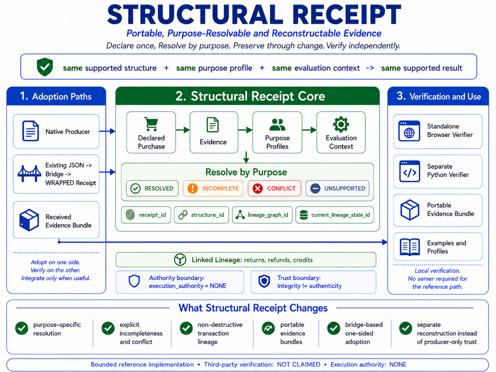

# 🧾 **Structural Receipt**

## **Portable, Purpose-Resolvable and Reconstructable Evidence for Purchases and Financial Transactions**

### **Declare once. Resolve by purpose. Preserve through change. Verify independently.**


---

# **One transaction should not have to be understood from scratch every time it is used.**

Structural Receipt is a deterministic architecture for turning a receipt from a passive transaction document into a portable, purpose-resolvable evidence structure.

It asks a narrower question than:

`is this receipt valid?`

It asks:

# **What is this exact available structure sufficient to establish for this exact declared purpose?**

The same transaction evidence can therefore support different legitimate results for different questions without forcing every downstream system into one universal validity flag.

The current release combines:

`portable transaction evidence`

`+ explicit dependencies`

`+ identified purpose-specific rules`

`+ declared evaluation context`

`+ authority boundaries`

`+ non-destructive lineage`

`+ reconstructable identities`

`-> deterministic supported state`

Structural Receipt is developed within the **Shunyaya Framework**.

Its adoption principle is:

# **Adopt on one side. Verify on the other. Integrate only when useful.**

---

# 🏗️ **Structural Receipt Architecture at a Glance**

[](docs/Structural-Receipt-Architecture-Diagram.png)

A visual overview of the Structural Receipt model, from declared transaction structure and purpose resolution through lineage, portable evidence, bridge-based adoption, and local verification.

---

# 🗂️ **Repository Components**

Structural Receipt v0.5.3 is organized by architectural role rather than by file type.

| Folder | Role |
|---|---|
| [`demo/`](demo/) | Interactive browser reference implementation for creating, resolving, evolving, inspecting, and exporting Structural Receipt evidence. |
| [`verify/`](verify/) | Standalone browser verification, separate Python reconstruction, frozen conformance and adversarial corpora, and published verification evidence. |
| [`bridge/`](bridge/) | One-sided adoption tools for converting declared existing structured transaction data into provenance-preserving `WRAPPED` Structural Receipts. |
| [`profiles/`](profiles/) | The nine standalone canonical purpose-profile manifests and the identified complete purpose-profile set. |
| [`examples/`](examples/) | Reproducible cross-boundary examples showing browser-to-verifier verification and existing-JSON-to-Structural-Receipt adoption. |
| [`docs/`](docs/) | Entry documentation, architecture, canonicalization, purpose-profile specifications, adoption guidance, verification guidance, Quickstart, and FAQ. |

The main operational paths are:

`demo/ -> create and explore`

`verify/ -> reconstruct and challenge`

`bridge/ -> adopt from existing structured systems`

`profiles/ -> inspect the governing purpose contracts`

`examples/ -> reproduce complete cross-boundary flows`

`docs/ -> understand and use the implemented architecture`


Within the larger folders:

- `verify/evidence/` preserves release evidence separately from the verifier implementations and frozen test corpora.
- `examples/browser_to_verifier_roundtrip/` demonstrates portable verification across implementation boundaries.
- `examples/legacy_json_to_structural_receipt/` demonstrates one-sided adoption through the bridge.

For the complete repository layout and step-by-step usage, see [`docs/Quickstart.md`](docs/Quickstart.md).

---

# 🚀 **Try It in 60 Seconds**

1. Open [`demo/Structural_Receipt_Reference_Demo_v0_5_3.html`](demo/Structural_Receipt_Reference_Demo_v0_5_3.html) in a current browser.
2. Inspect how one receipt resolves differently across the nine current purpose profiles.
3. Add supported return or refund lineage and observe the distinction between original receipt identity and current lineage state.
4. Export an evidence bundle.
5. Open [`verify/Structural_Receipt_Standalone_Verifier_v0_5_3.html`](verify/Structural_Receipt_Standalone_Verifier_v0_5_3.html) and load the exported bundle.
6. Open the browser developer console in the reference demo and run:

```javascript
await SR_AUDIT.runAll()
```

Expected current principal result:

```text
TOTAL                    221/221 PASS
INTEGRITY REGRESSION     0
UNEXPECTED MUTATION      0
FINAL STATUS             PASS
```

The current quick regression audit reports:

`72/72 PASS`

The current browser release also carries:

`122 permanent regression checks`

The full browser audit is a **producer-side reference audit**.

It is not third-party verification.

---

# 🌉 **Start Without Integration**

Structural Receipt does not require both sides of a transaction to adopt the system at the same time.

Choose the path that matches what you already have.

## **I received a Structural Receipt evidence bundle**

Open:

[`verify/Structural_Receipt_Standalone_Verifier_v0_5_3.html`](verify/Structural_Receipt_Standalone_Verifier_v0_5_3.html)

Load the bundle and verify it locally.

`receive bundle -> open verifier -> load bundle -> reconstruct`

No account, server, API integration, shared database, or producer connection is required for the supported verification path.

## **I already have transaction data in JSON**

Use the bridge:

`existing JSON -> declared adapter -> WRAPPED Structural Receipt -> verification`

You do not need to replace the existing transaction system.

The original source identity, unmapped fields, provenance boundary, and:

`semantic_equivalence = NOT_ASSUMED`

remain explicit.

## **I control the producing system**

Add Structural Receipt as a sidecar:

`existing transaction system -> Structural Receipt sidecar -> portable evidence bundle`

The existing receipt, application, or workflow may remain unchanged.

The adoption principle is:

**Adopt on one side. Verify on the other. Integrate only when useful.**

A simple example:

A finance team receives a supported evidence bundle from another system. It reconstructs the bundle locally and may find:

`PURCHASE_DECLARATION -> RESOLVED`

while:

`PAYMENT_MATCH -> INCOMPLETE`

The Structural Receipt result does not approve reimbursement or posting. It gives the finance team a bounded, reconstructable input for its own policy and workflow.

---

# 🧠 **The Problem: One Transaction, Many Local Truths**

A conventional receipt records a transaction at one moment and then goes quiet.

The transaction does not go quiet.

It may later pass through:

- payment confirmation;
- delivery;
- expense submission;
- accounting preparation;
- a return;
- a refund;
- a warranty claim;
- an audit;
- another downstream process.

The same underlying transaction may therefore be:

- rendered repeatedly;
- extracted repeatedly;
- entered repeatedly;
- interpreted repeatedly;
- reconciled repeatedly;
- classified repeatedly;
- reconstructed later from fragmented evidence.

The deeper pain is not paper.

It is this:

`the same transaction evidence is repeatedly interpreted by each downstream system, and those interpretations can silently become local truth`

Structural Receipt changes the architectural question from:

`what data does this receipt contain?`

to:

`what does the currently available structure support for this declared purpose?`

---

# 🧩 **The Core Structural Model**

The current conceptual object is:

`SR = (C, E, D, L, O, V)`

where:

`C = declared claims and purchase structure`

`E = available evidence`

`D = declared purpose dependencies`

`L = linked transaction lineage`

`O = origin and provenance class`

`V = versioned schemas, rules, profiles, contexts, and identities`

Purpose resolution is:

`result_P = resolve(SR, purpose_profile_P, evaluation_context)`

The same structural receipt may therefore produce different legitimate answers for different purposes.

The current architecture preserves:

`missing required evidence -> INCOMPLETE`

`incompatible required evidence -> CONFLICT`

`unsupported profile or monetary boundary -> UNSUPPORTED`

`resolved negative outcome != unresolved state`

and:

`purpose result != execution authority`

Every current purpose profile carries:

`execution_authority = NONE`

---

# 🎯 **One Receipt, Many Answers**

The current release contains nine bounded purpose profiles:

`PURCHASE_DECLARATION`

`ARITHMETIC_CHECK`

`PAYMENT_MATCH`

`EXPENSE_EVIDENCE`

`WARRANTY_EVIDENCE`

`RETURN_ELIGIBILITY_EVIDENCE`

`LINEAGE_CURRENT_STATE`

`ACCOUNTING_CLASSIFICATION`

`AUDIT_TRACE`

One supported receipt may therefore produce results such as:

| Purpose | Example supported result | What it does not automatically mean |
|---|---|---|
| `PURCHASE_DECLARATION` | `RESOLVED + PURCHASE_DECLARED` | Independent payment proof |
| `ARITHMETIC_CHECK` | `RESOLVED + ARITHMETIC_CONSISTENT` | Issuer authenticity |
| `PAYMENT_MATCH` | `RESOLVED + MATCHED` or `INCOMPLETE` | Delivery or settlement authority |
| `WARRANTY_EVIDENCE` | `RESOLVED + PURCHASE_EVIDENCE_AVAILABLE` | Warranty approval |
| `LINEAGE_CURRENT_STATE` | `RESOLVED + bounded current state` | Universal legal truth |
| `ACCOUNTING_CLASSIFICATION` | `RESOLVED + PROPOSED` | Approval or posting |
| `AUDIT_TRACE` | `RESOLVED + TRACE_RECONSTRUCTABLE` | Third-party certification |

These results do not contradict one another.

They answer different questions.

Structural Receipt therefore rejects the unsafe abstraction:

`one receipt -> one universal validity flag`

---

# 🛑 **Absence and Conflict Stay Visible**

Structural Receipt is designed to preserve uncertainty rather than convert missing or incompatible evidence into convenient truth.

The current resolution states include:

`RESOLVED`

`INCOMPLETE`

`CONFLICT`

`UNSUPPORTED`

The evaluation layer also supports:

`NOT_EVALUATED`

The core laws are:

`required evidence missing -> INCOMPLETE`

`required evidence incompatible -> CONFLICT`

`unsupported declared boundary -> UNSUPPORTED`

not:

`missing -> assumed true`

and not:

`conflicting -> silently choose one`

A resolved negative outcome is still different from an unresolved state.

---

# ⚖️ **Resolution Is Not Universal Authority**

Structural Receipt separates:

`claim authority`

`evidence authority`

`resolution authority`

`policy authority`

`execution authority`

The current authority states include:

`DECLARATION_ONLY`

`CHECK_ONLY`

`EVIDENCE_ONLY`

`STATE_ONLY`

`PROPOSAL_ONLY`

`TRACE_ONLY`

For every currently implemented purpose:

`execution_authority = NONE`

This preserves distinctions such as:

`RESOLVED != AUTHENTICATED`

`AUTHENTICATED != REAL-WORLD OCCURRENCE PROVEN`

`RESOLVED != APPROVED`

`APPROVED != EXECUTED`

`producer assertion != verification authority`

A deterministic accounting proposal is still only a proposal.

A matched payment result is still only a bounded payment-evidence result.

A proof-of-purchase result is still not a warranty approval.

---

# 🔐 **Integrity, Authenticity, and Truth Remain Separate**

The current trust-context profile separates:

`structural_integrity_state`

`provenance_state`

`issuer_authenticity_state`

`physical_occurrence_state`

`execution_authority`

For the current unauthenticated reference path:

`structural_integrity_state = RECONSTRUCTABLE`

`issuer_authenticity_state = NOT_ESTABLISHED`

`physical_occurrence_state = NOT_ESTABLISHED`

`execution_authority = NONE`

The governing trust boundary is:

`integrity != authenticity`

`authenticity != truth`

`truth != fitness for every purpose`

Structural Receipt does not turn successful structural reconstruction into a claim that a real-world transaction definitely occurred.

---

# 🔄 **Preserve Through Change**

A transaction may later be returned, refunded, credited, corrected, or otherwise changed.

Structural Receipt records supported change through linked lineage events.

The governing relation is:

`change -> linked lineage event`

not:

`change -> silent historical replacement`

The current architecture separates:

`receipt_id`

`structure_id`

`lineage_graph_id`

`current_lineage_state_id`

This allows the original purchase declaration to remain addressable while later lifecycle events change the lineage graph and the bounded current state.

The architecture therefore preserves both:

`what was declared originally`

and:

`what the supported current state is now`

---

# 🧭 **The Rules Are Also Identified Structure**

Structural Receipt does not treat purpose labels as informal names only.

Each current purpose profile is published as an identified canonical manifest.

The governing relation is:

`the rules governing the question are themselves declared identified structure`

The architecture can therefore distinguish:

`same purpose name + same governing profile identity`

from:

`same purpose name + changed governing profile identity`

The current purpose-manifest set identity is:

```text
20c55cd83bce5eb9590c757fc972880c11126249a2ed033f1f3b49249de6e381
```

This allows evidence and verification to bind not only to transaction structure, but also to the declared rules under which a question was evaluated.

---

# ⏱️ **Declared Context Instead of Hidden Context**

Some transaction questions are time-relative.

Structural Receipt does not silently use the current wall clock as undeclared resolution authority.

The current identified evaluation-context subject contains:

`profile = SR-EVALUATION-CONTEXT-1-D01`

`as_of`

`jurisdiction_profile`

`currency_profile`

The governing relation is:

`same receipt + same purpose profile identity + same declared evaluation context -> same supported result`

This makes later reconstruction possible without depending on an invisible ambient `now`.

The current architecture therefore preserves:

`time-relative question + explicit as_of -> deterministic supported result`

not:

`time-relative question + ambient clock -> hidden dependency`

The browser reference also uses a local monotonic counter for transient new-item UI identifiers. Those identifiers do not enter the normative Structural Receipt identity subjects.

---

# 💰 **Exact Money and Explicit Monetary Boundaries**

The current exact-money profile is:

`SR-MONEY-2DP-1-D01`

Normative money values are represented as exact decimal strings under the supported two-decimal path rather than ordinary binary floating-point money.

The current money-context boundary recognizes that currencies can use different exponents.

The governing relation is:

`unsupported monetary scale -> UNSUPPORTED`

not:

`unsupported monetary scale -> silent two-decimal coercion`

The current hostile-input corpus permanently covers supported exact values and explicit unsupported exponent boundaries.

---

# 🌉 **Open-Boundary Adoption**

Structural Receipt v0.5.3 is designed so that both sides do not need to migrate at the same time.

The release supports three adoption paths.

## **Producer-Side Adoption**

`existing transaction system -> Structural Receipt sidecar -> portable evidence bundle -> recipient verifier`

A producer can add a Structural Receipt sidecar without replacing the existing customer-facing receipt or transaction system.

## **Verifier-Side Adoption**

`existing transaction data -> declared bridge or adapter -> WRAPPED Structural Receipt -> purpose resolution or verification`

A recipient can begin using Structural Receipt even when the original producer does not natively issue it.

## **Native End-to-End Adoption**

`native Structural Receipt producer -> portable evidence bundle -> Structural Receipt-aware verifier`

When both sides support the structure, richer interoperability becomes possible.

The adoption progression is:

`one adopting side -> immediate bounded utility`

`two adopting sides -> richer interoperability`

`many adopting sides -> broader portability`

The practical principle remains:

# **Adopt on one side. Verify on the other. Integrate only when useful.**

---

# 🔍 **Verification Without Integration**

A recipient should not need the producer's original application or producer-generated PASS assertions as verification authority merely to reconstruct the bounded structural claims carried by a supported evidence bundle.

The current standalone verifier supports:

`portable bundle -> local reconstruction -> PASS / FAIL / UNSUPPORTED`

without requiring:

- a shared account;
- a central registry;
- a shared database;
- a cloud dependency;
- prior API integration;
- the producer application to remain available.

The demonstrated cross-boundary path is:

`browser producer -> exported evidence bundle -> standalone browser verifier -> PASS`

and:

`browser producer -> exported evidence bundle -> separate Python verifier -> PASS`

The published clean SR-1001 reference bundle carries:

`bundle_id = 736be993cf8811d66efbfba8f8891fc396846f89188972d7d81b6769e2b8260f`

A deliberate material mutation of the declared total is rejected.

The current machine-readable verification result profile is:

`SR-VERIFICATION-RESULT-1-D01`

The claim boundary remains:

`separate implementation reconstruction = demonstrated`

`third-party verification = NOT_CLAIMED`

---

# 🌁 **Bridge from Existing Systems**

Structural Receipt does not require every existing source system to implement the native structure immediately.

The current bridge supports:

`existing JSON + declared adapter manifest -> WRAPPED Structural Receipt`

The bridge preserves:

`source artifact identity`

`source profile`

`unmapped source fields`

`declared warnings`

`origin_class = WRAPPED`

`semantic_equivalence = NOT_ASSUMED`

Successful conversion therefore does not silently become a claim that the source schema and Structural Receipt schema are completely equivalent.

The current bridge self-test reports:

`21/21 PASS`

The bridge also permanently verifies:

- deterministic output;
- source artifact hashing;
- duplicate-key rejection;
- missing required-field rejection;
- invalid imported-quantity rejection;
- unsupported currency-exponent handling;
- unmapped-field preservation;
- origin-class preservation;
- semantic-equivalence restraint.

---

# 🧬 **Origin Classes Stay Visible**

The current architecture distinguishes:

`NATIVE`

`WRAPPED`

`DERIVED`

A native Structural Receipt is created from declared transaction structure at origin.

A wrapped Structural Receipt is produced from an existing structured source through a declared adapter.

A derived Structural Receipt is reconstructed from a presentation or manually supplied source.

The active receipt boundary accepts only:

`NATIVE | WRAPPED | DERIVED`

An unsupported imported origin class is rejected before admission into active receipt state, and displayed origin labels are escaped defensively at the presentation boundary.

The architecture preserves:

`NATIVE != WRAPPED != DERIVED`

and:

`successful transformation != complete semantic equivalence`

This allows interoperability without erasing provenance.

---

# 📦 **Portable Evidence and Purpose Receipts**

The current release can produce and reconstruct:

- canonical receipt identities;
- full structure identities;
- purpose-profile identities;
- purpose-manifest set identity;
- declared evaluation-context identity;
- lineage graph identity;
- bounded current lineage-state identity;
- purpose result identities;
- purpose receipt identities;
- evidence bundle identity;
- adapter contracts;
- machine-readable verification results.

The portable evidence boundary is designed around reconstruction rather than producer assertion.

The governing relation is:

`producer-generated PASS != verification authority`

A verifier recomputes the supported identities and states from the declared evidence subject.

---

# 🔒 **Canonical Identity**

The current canonicalization profile is:

`SR-CANON-1-D01`

The strict JSON input profile is:

`SR-JSON-INPUT-1-D01`

The current relation is:

`external JSON text -> strict input validation -> supported parsed value -> canonicalization -> identity construction`

The current strict input boundary includes:

`duplicate object key -> rejected`

`trailing non-whitespace data -> rejected`

`malformed JSON -> rejected`

`non-finite numeric value -> rejected`

`invalid imported item quantity -> rejected`

`unsupported imported origin class -> rejected before active-state admission`

Arrays preserve order.

Objects use deterministic property ordering within the declared supported profile.

Strings are preserved as supplied to the canonical subject.

The current profile does not perform Unicode normalization.

Canonicalization does not decide which fields belong to an identity subject.

The defining identity profile does.

Therefore:

`identity subject selection != canonicalization`

---

# 🧪 **Frozen Conformance, Tamper, and Hostile-Input Evidence**

The current frozen conformance corpus contains:

`18 vectors`

The current demonstrated conformance result is:

`308/308 PASS on the browser path`

`308/308 PASS on the separate Python path`

The current tamper corpus contains:

`12 cases`

with:

`12/12 PASS on the browser path`

`12/12 PASS on the separate Python path`

The current hostile-input corpus contains:

`13 cases`

with:

`13/13 PASS on the browser path`

`13/13 PASS on the separate Python path`

Published semantic corpus identities:

## **Conformance**

```text
9f1d59ce40ab2c4a56e0d4f3753ae41d13844cd580377bbf565ef54330df889e
```

## **Tamper**

```text
3c681d0d3b3a20a16796fea0273cab0a6412ad17ecd2da433ad470a8bdc9c0e5
```

## **Hostile Input**

```text
1bc1a5a52719025c9d092df825d500c7b883e0a84bd695726163798323ef6603
```

These are semantic corpus identities under the current Structural Receipt profiles.

The root `SHA256SUMS.txt` is used separately as the sole authoritative exact-byte checksum manifest for the four selected executable artifacts:

`demo/Structural_Receipt_Reference_Demo_v0_5_3.html`

`verify/Structural_Receipt_Standalone_Verifier_v0_5_3.html`

`verify/Structural_Receipt_Independent_Verifier_v0_5_3.py`

`bridge/Structural_Receipt_Bridge_v0_5_3.py`

`semantic identity != file checksum`

Both answer different questions.

---

# 📊 **Where Structural Receipt Stands Among Existing Mechanism Classes**

Structured receipt and invoicing mechanisms, application-centered transaction workflows, cryptographic integrity mechanisms, provenance systems, and transaction-history mechanisms already solve important problems.

Structural Receipt does not claim to invent those mechanisms.

Its bounded differentiation lies in the combination:

`purpose-specific deterministic resolution`

`+ explicit incompleteness`

`+ explicit conflict`

`+ origin-aware evidence`

`+ identified purpose profiles`

`+ declared evaluation context`

`+ non-destructive lineage`

`+ presentation-independent identity`

`+ portable bounded verification`

`+ adapter-first interoperability`

The following table describes common architectural emphasis, not universal behavior of every implementation in each category.

| Property | Passive receipt or presentation | Structured transaction document | Application-specific workflow | Structural Receipt |
|---|---|---|---|---|
| Primary role | Record or present a transaction | Represent transaction data | Process one application use | Resolve bounded questions from declared evidence |
| One universal validity flag avoided by design | Not usually a core concern | Not necessarily | Application-specific | Yes |
| Purpose-specific identified rule profiles | Not core | Varies | Often local to the application | Yes |
| Explicit `INCOMPLETE` and `CONFLICT` states | Not core | Varies | Workflow-dependent | Yes |
| Declared evaluation context | Not core | Varies | Often implicit or application-held | Yes |
| Origin class preserved | Presentation origin may be known | Format-dependent | Application-dependent | `NATIVE`, `WRAPPED`, `DERIVED` |
| Non-destructive lineage identity | Not core | Varies | Often represented in local workflow state | Yes |
| Portable verifier-facing reconstruction | Not core | Format-dependent | Usually application-dependent | Demonstrated within frozen profiles |
| One-sided adoption path | Not applicable | Integration-dependent | Usually integration-dependent | Bridge, sidecar, and standalone verification paths |
| Execution authority separated from resolution | Not core | Not necessarily | Workflow-dependent | Explicitly `NONE` in current profiles |

The central distinction is:

`financial application asks: what should this workflow do?`

`Structural Receipt asks: what does this declared evidence support for this declared purpose?`

Structural Receipt is therefore positioned as:

**a structural resolution layer between financial evidence and downstream conclusions.**

---

# ✅ **Current Reference Status: Structural Receipt v0.5.3**

| Check | Result |
|---|---:|
| Browser full release audit | **221/221 PASS** |
| Browser quick regression | **72/72 PASS** |
| Permanent browser regression checks | **120** |
| Standalone verifier audit | **35/35 PASS** |
| Standalone verifier quick audit | **12/12 PASS** |
| Permanent standalone verifier regressions | **23** |
| Frozen conformance corpus | **308/308 PASS** |
| Separate Python conformance reconstruction | **308/308 PASS** |
| Browser tamper corpus | **12/12 PASS** |
| Separate Python tamper corpus | **12/12 PASS** |
| Browser hostile-input corpus | **13/13 PASS** |
| Separate Python hostile-input corpus | **13/13 PASS** |
| Clean bundle reconstruction | **20/20 PASS** |
| Browser-to-standalone bundle path | **PASS** |
| Browser-to-Python bundle path | **PASS** |
| Deliberately tampered bundle rejection | **PASS** |
| Bridge self-test | **21/21 PASS** |
| Third-party verification | **Not claimed** |
| Execution authority | **NONE** |

The current evidence establishes bounded reproducible behavior under the declared frozen profiles.

It does not establish universal correctness for every possible financial document, jurisdiction, policy, or external truth claim.

---

# 🧪 **Browser Full-Audit Groups**

| Group | Result |
|---|---:|
| Canonicalization | **12/12 PASS** |
| Exact Money | **9/9 PASS** |
| Purpose Resolution | **20/20 PASS** |
| Dependency Model | **10/10 PASS** |
| Authority Boundary | **14/14 PASS** |
| Provenance & Identity | **8/8 PASS** |
| Lineage | **11/11 PASS** |
| Comparison | **5/5 PASS** |
| Metamorphic Safety | **9/9 PASS** |
| Trust Separation | **6/6 PASS** |
| Portable Evidence | **14/14 PASS** |
| Lineage Identity | **6/6 PASS** |
| Adapter Boundary | **6/6 PASS** |
| Verifier Reconstruction | **6/6 PASS** |
| Frozen Conformance | **8/8 PASS** |
| Tamper Corpus | **7/7 PASS** |
| Separate Verifier Fixtures | **4/4 PASS** |
| Demonstration Cases | **10/10 PASS** |
| Purpose Profile Data | **6/6 PASS** |
| Evaluation Context | **8/8 PASS** |
| Trust Context | **6/6 PASS** |
| Money Profile Boundary | **5/5 PASS** |
| Hostile Input | **6/6 PASS** |
| v0.5 Release Fixtures | **5/5 PASS** |
| Release Consistency | **9/9 PASS** |
| UI Security | **7/7 PASS** |
| UI Interaction | **4/4 PASS** |

The browser result is a producer-side release audit.

The separate Python implementation provides a distinct reconstruction path for the frozen verification subjects.

Neither is presented as third-party certification.

---

# 🧪 **Verify It Yourself**

## **Browser Full Release Gate**

Open the reference demo and run:

```javascript
await SR_AUDIT.runAll()
```

Expected current result:

`221/221 PASS`

## **Quick Browser Regression**

```javascript
await SR_AUDIT.quick()
```

Expected:

`72/72 PASS`

## **Frozen Conformance**

```javascript
SR_AUDIT.runConformance()
```

Expected:

`308/308 PASS`

## **Tamper Corpus**

```javascript
SR_AUDIT.runTamperCorpus()
```

Expected:

`12/12 PASS`

## **Hostile-Input Corpus**

```javascript
SR_AUDIT.runHostile()
```

Expected:

`13/13 PASS`

## **Standalone Verifier Audit**

Open the standalone verifier and run:

```javascript
await SR_AUDIT.runAll()
```

Expected:

`35/35 PASS`

Quick verifier audit:

```javascript
await SR_AUDIT.quick()
```

Expected:

`12/12 PASS`

## **Separate Python Verification**

From the `verify` folder:

```bat
python Structural_Receipt_Independent_Verifier_v0_5_3.py --all --verbose
```

Expected principal results:

```text
CONFORMANCE              308/308 PASS
TAMPER CORPUS             12/12 PASS
HOSTILE INPUT CORPUS      13/13 PASS
THIRD-PARTY VERIFICATION  NOT_CLAIMED
```

To verify one exported evidence bundle:

```bat
python Structural_Receipt_Independent_Verifier_v0_5_3.py --bundle "path\to\evidence_bundle.json" --verbose
```

## **Standalone Browser Verification**

Open:

[`verify/Structural_Receipt_Standalone_Verifier_v0_5_3.html`](verify/Structural_Receipt_Standalone_Verifier_v0_5_3.html)

Load a supported Structural Receipt evidence bundle.

The verifier reconstructs the declared identities and verification checks locally.

Its dedicated verifier audit reports:

`35/35 PASS`

with:

`12/12 PASS`

for the quick verifier gate.

## **Bridge Self-Test**

From the `bridge` folder:

```bat
python Structural_Receipt_Bridge_v0_5_3.py --self-test
```

Expected:

`21/21 PASS`

The bridge can then convert declared external JSON through the published adapter manifest without claiming complete semantic equivalence.

---

# 🧯 **Permanent Regression Discipline**

The current browser release carries:

`122 permanent regression checks`

The governing development law is:

`bug found -> fix implemented -> permanent regression test added -> full audit must pass`

The current regression boundary includes protection for:

- canonical identity behavior;
- exact-money handling;
- authority separation;
- trust separation;
- purpose profiles;
- evaluation context;
- lineage identity;
- evidence reconstruction;
- adapter boundaries;
- frozen corpus identity parity;
- tamper rejection;
- hostile input;
- release consistency;
- filename sanitization;
- markup-injection resistance;
- imported origin-class admission control;
- monotonic transient item-ID generation;
- tactile button interaction;
- live audit progress.

The objective is:

`discover each deterministic bug once`

---

# 🏗️ **Position in the Shunyaya Ecosystem**

Structural Receipt is developed within the **Shunyaya Framework**.

Its structural relation is:

`transaction evidence -> declared purpose -> structural resolution -> bounded result -> portable evidence`

Its ecosystem-level dependency row is:

| Domain | Dependency reduced from sole authority | Structural basis |
|---|---|---|
| Purchase and financial evidence | Repeated downstream interpretation of receipt presentations and application-specific records | Canonical evidence structure + identified purpose profiles + declared context + lineage + bounded verification |

The project-level dependency statement is:

> **Structural Receipt explores whether repeated downstream interpretation can cease to remain the sole authority over what transaction evidence supports, while existing financial applications and workflows continue to operate.**

The operational systems may remain.

The authority model changes.

---

# 📚 **Release Documentation**

- [Quickstart](docs/Quickstart.md)
- [FAQ](docs/FAQ.md)
- [Architecture Diagram](docs/Structural-Receipt-Architecture-Diagram.png)
- [Entry Document](docs/Structural_Receipt_Entry_Document_v0_5_3.txt)
- [Core Architecture and Deployment Direction](docs/Structural_Receipt_Core_Architecture_and_Deployment_Direction_v0_5_3.txt)
- [Adoption and Interchange Guide](docs/Structural_Receipt_Adoption_and_Interchange_Guide_v0_5_3.txt)
- [Verification Guide](docs/Structural_Receipt_Verification_Guide_v0_5_3.txt)
- [Documentation Index](docs/Structural_Receipt_Documentation_Index_v0_5_3.txt)
- [Purpose Profiles and Evaluation Context](docs/Structural_Receipt_Purpose_Profile_Manifest_and_Evaluation_Context_v0_5_3.txt)
- [Verification Summary](verify/Structural_Receipt_Verification_Summary_v0_5_3.txt)

---

# 📚 **Technical Specifications**

## **Canonicalization Profile**

[`docs/Structural_Receipt_Canonicalization_Profile_SR_CANON_1_D01_v0_5_3.txt`](docs/Structural_Receipt_Canonicalization_Profile_SR_CANON_1_D01_v0_5_3.txt)

Defines:

- supported canonical data model;
- strict JSON input boundary;
- deterministic object-key ordering;
- preserved array order;
- no Unicode normalization under the current profile;
- exact-money boundary;
- identity-subject separation;
- cross-implementation claim boundary.

## **Purpose Profiles and Evaluation Context**

[`docs/Structural_Receipt_Purpose_Profile_Manifest_and_Evaluation_Context_v0_5_3.txt`](docs/Structural_Receipt_Purpose_Profile_Manifest_and_Evaluation_Context_v0_5_3.txt)

Defines:

- the nine current purpose profiles;
- purpose-profile manifest identity;
- purpose-manifest set identity;
- required dependencies;
- purpose outcomes;
- authority states;
- explicit `execution_authority = NONE`;
- declared evaluation context;
- ambient-time prohibition for normative time-relative resolution and identity construction;
- money-context boundary;
- trust context;
- purpose result and purpose receipt integration.

## **Core Architecture**

[`docs/Structural_Receipt_Core_Architecture_and_Deployment_Direction_v0_5_3.txt`](docs/Structural_Receipt_Core_Architecture_and_Deployment_Direction_v0_5_3.txt)

Defines:

- the core Structural Receipt object;
- purpose-resolved evidence;
- dependency and authority separation;
- trust boundaries;
- non-destructive lineage;
- evidence bundles;
- open-boundary adoption;
- verification without integration;
- bridge and adapter architecture;
- current conformance evidence;
- deployment direction;
- claim boundaries.

---

# 🔬 **Future Direction: Purpose-Limited Disclosure**

The current release does not implement selective disclosure.

The future architecture direction explores:

`purpose-scoped resolution -> purpose-scoped disclosure`

with proposed future profile directions including:

`SR-COMMIT-1-D01`

`SR-DISCLOSE-1-D01`

`SR-PDC-1-D01`

The intended principle is:

`full-document disclosure -> no longer the sole path to purpose-specific verification`

The future direction preserves the distinction:

`semantic receipt identity != commitment identity`

and:

`committed != authenticated`

and:

`disclosed-subset verification != full-receipt verification`

This remains a future architecture direction.

It is not implemented or frozen in v0.5.3.

---

# ⚖️ **Claim Boundary**

Structural Receipt v0.5.3 is a reference architecture and implementation release.

The current project demonstrates, within its declared frozen profiles:

- purpose-specific deterministic resolution;
- explicit `INCOMPLETE`, `CONFLICT`, and `UNSUPPORTED` conditions;
- identified purpose-profile manifests;
- declared evaluation context;
- exact two-decimal money handling within the supported profile;
- explicit trust and authority separation;
- `NATIVE`, `WRAPPED`, and `DERIVED` origin boundaries;
- non-destructive transaction lineage;
- separate receipt, structure, lineage-graph, and current-state identities;
- portable purpose receipts;
- portable evidence bundles;
- standalone local bundle reconstruction;
- separate Python reconstruction;
- frozen conformance, tamper, and hostile-input corpora;
- generic bridge-based one-sided adoption;
- provenance-preserving WRAPPED conversion;
- deterministic bridge self-testing;
- reproducible cross-boundary examples.

The project does not currently claim:

- universal financial truth;
- issuer authenticity from structural reconstruction alone;
- real-world physical occurrence proof from structural reconstruction alone;
- legal validity;
- tax correctness;
- accounting correctness;
- payment-network settlement authority;
- warranty approval;
- reimbursement approval;
- operational execution authority;
- production readiness by default;
- jurisdiction-wide acceptance;
- universal interoperability;
- third-party certification;
- that every possible JSON value is covered by the current canonicalization profile;
- that a successful adapter conversion establishes complete semantic equivalence;
- that the current frozen corpus proves absence of all defects;
- that future selective-disclosure profiles are implemented.

The current trust principle is:

`do not claim more than the structurally reconstructed evidence can support`

---

# 🧪 **How to Challenge Structural Receipt**

Useful falsification targets include:

- the same frozen subject and profiles producing different supported identities;
- a missing required dependency resolving as though it were present;
- incompatible required evidence being silently accepted;
- an unsupported money exponent being silently coerced into the supported profile;
- a producer-generated PASS assertion overriding failed reconstruction;
- a changed receipt payload preserving an invalid old bundle identity;
- a tampered purpose receipt passing reconstruction;
- a trust-context escalation passing verification;
- a duplicate JSON key being accepted by the strict import boundary;
- trailing JSON data being accepted;
- duplicate lineage events being silently counted twice;
- a lineage mutation silently rewriting the original receipt identity;
- the same purpose name silently changing rules without changing profile identity;
- hidden ambient time changing a time-relative result;
- a WRAPPED conversion claiming semantic equivalence that was not established;
- a standalone verifier accepting a materially tampered evidence bundle;
- a bridge conversion losing declared unmapped fields or source provenance;
- a release artifact disagreeing with the published frozen corpus identities.

A reproducible counterexample is more useful than a broad claim.

---

# 🧩 **Current Development Discipline**

The project follows:

`bug found -> fix implemented -> permanent regression test added -> full audit must pass`

Release identity, purpose-profile identity, evidence identity, corpus identity, and executable-file integrity are treated as separate concerns.

The intended assurance relation is:

`implemented behavior + declared profile boundary + reproducible verification evidence -> bounded demonstrated claim`

not:

`one successful demo -> universal proof`

---

# 📜 **License**

See: [LICENSE](LICENSE)

This repository is a publicly available reference implementation provided under the license terms stated in the repository.

Architecture documentation is subject to the applicable licensing terms declared in the repository, including CC BY-NC 4.0 where stated.

This repository does not claim recognition as a formal technical standard.

---

# **Final Principle**

## **Declare once. Resolve by purpose. Preserve through change. Verify independently.**

For adoption:

## **Adopt on one side. Verify on the other. Integrate only when useful.**
